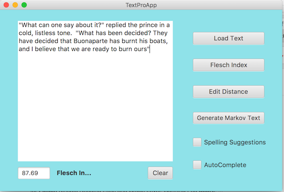
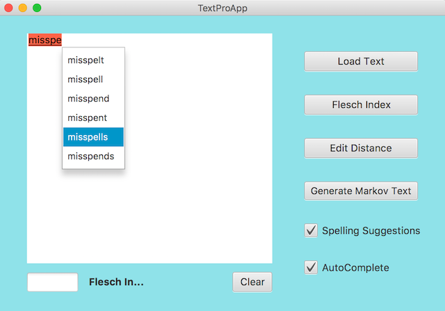
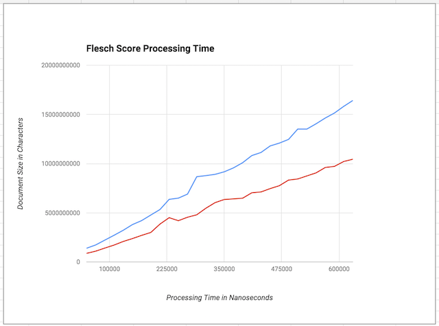
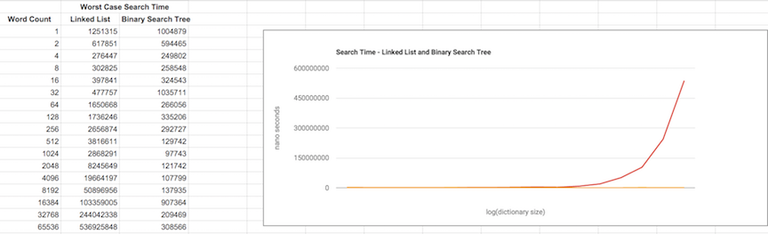

# <i>Data Structures: Measuring and Optimizing Performance</i>
This is the second course in a 5-course series, the <i>Java Programming: Object-Oriented Design of Data Structions 
Specialization</i>.  The course was developed by the University of California San Diego and is offered through Coursera.

## Text Editor
The programming project involved development of back-end software for a text editor.  This section details the functions that were provided.

### Flesch Score
The Flesch Score calculates the complexity of text, using the following formula:

	Flesch Score = 206.835 - 1.015 * (words/sentences) - 84.6 * (syllables/words)

### Spell Checking and Auto Complete
The spell check feature marks misspelled words.  Auto-complete offers completion options.

## Implementation
### Data Structures & Algorithms
[Tries](https://en.wikipedia.org/wiki/Trie) were used to implement the auto-complete feature, where the key is a word and word completions are generated by listing words associated with subtrees of the prefix being completed.

To create spelling suggestions the [Edit Distance](https://en.wikipedia.org/wiki/Edit_distance) was calculated, using a level-order search of mutations of the misspelled word, where mutations are character substitutions, deletions and insertions.

### Performance Analysis
#### Flesch Score
The following chart compares the processing time of document parsing for single and multi-passes through a document. The red line graphs a single pass.  In the multi-pass case, the document is parsed three times, one each for counting sentences, words and syllables, shown by the blue line.

#### Linear vs. Binary Search
This graph compares the worst-case performance of doing a linear vs. a binary search of a dictionary, using a singly linked list and a balanced binary tree.

### Testing
Unit testing was done using [JUnit](http://junit.org).

## Course Topics
* Sentinel Nodes
* Parameterized Types
* Exceptions
* Singly, Doubly Linked Lists
* Binary Search Trees & Tries
* Hash Tables
* Algorithmic Complexity
	* Searching - Linear & Binary
	* Sorting - Selection, Insertion, Merge Sort & Quick Sort

## UC San Diego Course README
Starter Code and GUI Application for Course 2 in the
Java Programming: Object Oriented Design of Data Structures Specialization:

	Data structures: Measuring and Optimizing Performance
	https://www.coursera.org/learn/data-structures-optimizing-performance

Authored by UCSD MOOC Team:
Mia Minnes, Christine Alvarado, Leo Porter, Alec Brickman
and Adam Setters

Date: 10/29/2015

### Description
The files provided are skeleton code, as well as grading previews and 
testing files to be used in completing the course programming 
assignments. Additionally, you are provided a runnable JavaFX program 
which will help to test and demonstrate your implementations.

### Files By Week
Below are the files introduced in each week and used in each week
of the course. See file for description...

#### Week 1 : Introduction and Working with Strings
	document.Document.java
	document.BasicDocument.java

#### Week 2 : Efficiency Analysis and Benchmarking
	document.EfficientDocument.java

#### Week 3 : Interfaces, Linked Lists vs. Arrays, and Correctness
	textgen.MyLinkedList*.java
	textgen.MarkovTextGenerator.java
	textgen.MarkovTextGenerator*.java

#### Week 4 : Trees! (including Binary Search Trees and Tries)
	spelling.SpellingSuggest.java
	spelling.AutoComplete.java
	spelling.Dictionary.java
	spelling.Dictionary*.java
	spelling.AutoCompleteDictionaryTrie.java
	spelling.TrieNode.java

#### Week 5 : Hash Maps and Edit Distance
	spelling.WordPath.java
	spelling.NearbyWords.java
	spelling.WPTree.java

### Setup

Importing Project into eclipse:

	1. Create a new Java Project in your workspace
	2. Import the starter files:
	  File -> Import -> Select "File System" -> Next -> Browse and set 
	  root directory to folder contents of zip were extracted to -> Finish

Feel free to use another IDE or manually compile and run your programs.
If you need help, google is your friend.

### Acknowledgements
A big thank you to Tomas Mikula for creating [RichTextFX](https://github.com/TomasMikula/RichTextFX)
which was used as the text area in the GUI application.

