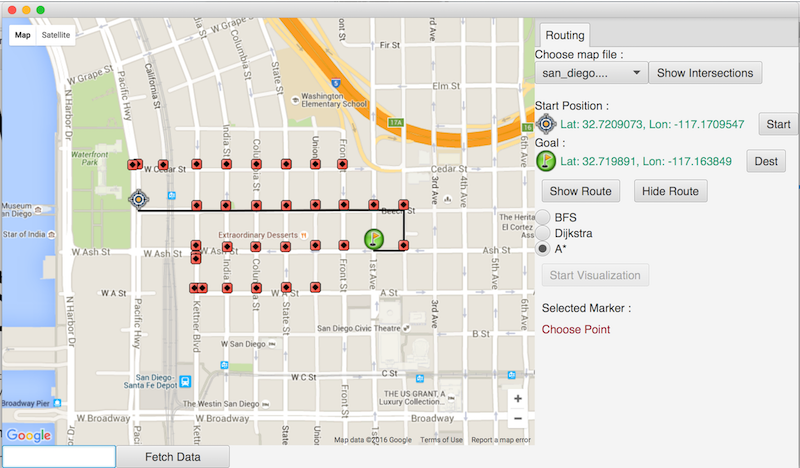

# <i>Advanced Data Structures in Java</i>
This is the third course in a 5-course series, the <i>Java Programming: Object-Oriented Design of Data Structions 
Specialization</i>.  The course was developed by the University of California San Diego and is offered through Coursera.

## Visualization
The project in this course involved development of search algorithms for finding the shortest route between two intersections in a road map. UC San Diego provided the road map application which can be seen below.

From the application, starting and ending nodes can be selected, as well as the type of search (BFS, Dijkstra and A*).  There is also an option to visualize the search algorithm as it visits intersections.  The visited intersections are shown in red, above.

## Design and Implemenation
### Degree Sequence
The <a href="https://en.wikipedia.org/wiki/Degree_(graph_theory)">degree sequence</a> of road graphs was calculated using adjacency matrices and adjacency lists.

### Breadth First Search
The following sections describe the extensions made to the  <b>roadgraph</b> package in support of shortest path calculations between two road intersections using a Breadth First Search algorithm.

#### Class: MapGraph
The MapGraph class represents geographic maps as locations and road intersections at these locations.

##### Variable: map
The map variable translates from geographic locations to MapNode objects, which represent road intersections.

##### Methods to Construct Graphs
Several methods are used to construct graphs. 
* <b>MapGraph()</b> - constructor method; creates a new, empty HashMap that translates geographic locations to MapNode objects.
* <b>addVertex()</b> - adds an intersection to the graph.
* <b>addEdge()</b> - adds a directed road segment between intersections.

##### Breadth First Search (bfs) Method
The bfs method finds the shortest path between two nodes in a directed graph.

##### Utility Methods
* <b>getNumVertices()</b> - returns number of intersections in the map; used by grader, only.
* <b>getVertices()</b> - returns all intersections in a map as a set; unused.
* <b>getNumEdges()</b> - returns number of directed road segments in a map; used by grader, only.

#### Class: MapNode
The MapNode class represents road intersections in a map.

##### MapNode Variables
Each MapNode consists of a geographic location and a list of directed road segments originating from the location. Road segments are represented as MapEdge objects.

##### Methods to Construct MapNodes
* <b>MapNode()</b> - the constructor method; creates a new MapNode at the specified location with an empty list of road segments.
* <b>AddEdge()</b> - adds a directed road segment, originating from MapNode.

##### Methods to Query MapNodes
* <b>getNumNodeEdges()</b> - returns number of directed road segments associated with the MapNode; used by grader, only.
* <b>getLoc()</b> - returns the geographic location of the MapNode.
* <b>getAdjacentNodes()</b> - returns a list of geographic locations for intersections that can be directly reached from the MapNode, without passing through additional intersections.

#### Class: MapEdge
The MapEdge class represents a directed road segment between two MapNodes. 

The variable members are:
* <b>end</b> - the ending MapNode for this road segment.
* <b>name</b> - the name of the road; not currently used.
* <b>type</b> - type of road (e.g., residential, city, connector); not currently used
* <b>distance</b> - length of road segment in kilometers.

There are two MapEdge methods:
* <b>MapEdge()</b> - the constructor method.
* <b>getEndNode()</b> - returns the ending MapNode for this road segment.

#### Overall Design Justification
The classes were designed to correspond to the functional components of a geographic map.  At the highest level, the map consists of the geographic locations of intersections.  The intersections are further described by the roads that emanate from them.  Directed road segments between intersections are the third and last functional component in this design.

Benefits of isolating the functional components to separate classes include 
* Isolation of implementation details of nodes and edges allows underlying structures to be changed without impacting other parts of the system.
* Easier maintenance due to a simpler code structure.
* Ease of extension because changes to single components can be made without impacting other parts of the system.
* Easier re-use in other applications with similar functional components, or similar distribution of components.

### A* Optimization
The A* algorithm was optimized to use previously found shortest paths.

#### Extension Description
The extension optimizes route displays on road maps, by avoiding recalculation of routes when possible.  If a user requests a route that someone else had previously requested, their route has already been calculated and will be displayed quickly.  This optimization is done on partial routes, too.  The only requirement being that a previously displayed route passed through the destination being requested.

#### Extension Design & Implementation
Using the facts that subpaths of optimal paths are also optimal, and that during an A\* search, if a node is visited which is on an optimal path, there will be no shorter path, I was able to optimize the A\* search by creating new paths, partially constructed from a saved path.
 
When a shortest path is reconstructed from a parent list, a reference to the path is saved in each node contained in the path.  Then when a subsequent
A* search is done, if a node with a shortest path is visited that contains the destination node, only the path up to the current node
needs to be reconstructed.  The remainder of the path is extracted from the saved shortest path. 

To fully implement this extension, there should be a way to age saved shortest paths, removing ones that are not frequently used.

## Course Topics
* Abstract Data Types
* Map Interface
* Priority Queues
* Graphs implemented as Adjacency Lists & Adjacency Matrices
* Unweighted & Weighted graphs
* Complexity of search algorithms.
* Complexity Theory - Polynomial Time, NP Hard & NP Complete problems
* Graph search algorithms - DFS, BFS, Dijkstra & A*
* Traveling Salesperson Problem, Hamilton Cycles & Eularian Graphs

## UC San Diego Course README
Starter Code and GUI Application for Course 3 in the Java Programming: Object Oriented Design of Data 
Structures Specialization:
	Advanced Data Structures in Java
	https://www.coursera.org/learn/advanced-data-structures

Authored by UCSD MOOC Team:
Mia Minnes, Christine Alvarado, Leo Porter, Alec Brickner and Adam Setters

Date: 12/16/2015

### Description
The files provided are skeleton code, as well as grading previews and 
testing files to be used in completing the course programming 
assignments. Additionally, you are provided a runnable JavaFX program 
which will help to test and demonstrate your implementations.

### Files by Week
Below are the files introduced in each week and used in each week
of the course. See file for description...

#### Week 1 : Introduction to the course and graphs
	basicgraph.Graph.java
	basicgraph.GraphAdjList.java
	basicgraph.GraphAdjMatrix.java

#### Week 2 : Class design and simple graph search
	roadgraph.MapGraph.java
	week2example.Maze.java
	week2example.MazeLoader.java
	week2example.MazeNode.java

#### Utility files
	geography.GeographicPoint.java
	geography.RoadSegment.java
	util.GraphLoader.java

### Setup
Importing Project into eclipse:
1. Create a new Java Project in your workspace
2. Import the starter files:
File -> Import -> Select "File System" -> Next -> Browse and set 
root directory to folder contents of zip were extracted to -> Finish

### Acknowledgements	
Feel free to use another IDE or manually compile and run your programs.
If you need help, google is your friend.
