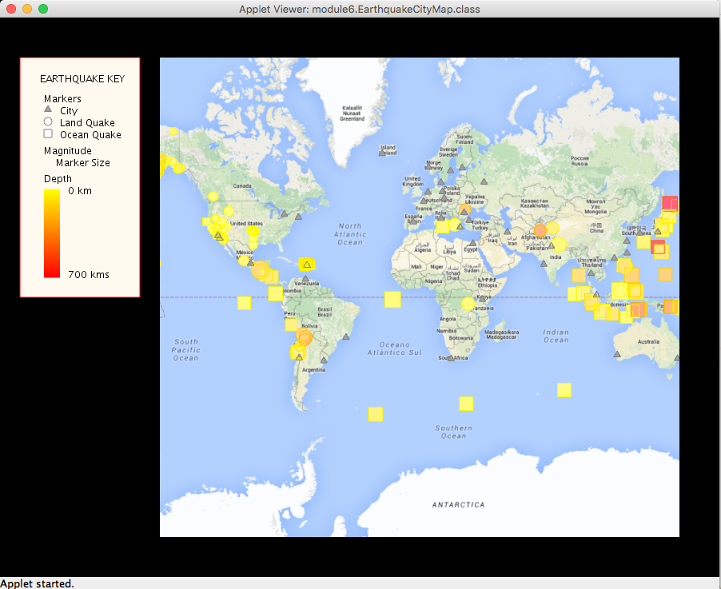

# <i>Object Oriented Programming in Java</i>

This is the first course in a 5-course series, the <i>Java Programming: Object-Oriented Design of Data Structions 
Specialization</i>.  The course was developed by the University of California San Diego and is offered through Coursera.

## Visualization

The programming exercises involved development of an interactive visualization of earthquakes across the world,
which can be seen, below.

### Mouse Movements
The map implements panning, zooming, hovering and clicking.

#### Hovering 
Hovering over an earthquake marker yields the magnitude and location.

Hovering over a city marker, displays the city and country names as well as the population.

#### Clicking
Clicking on an earthquake marker displays the earthquake and cities which are threatened by the earthquake.

Clicking on a city marker, displays the city and all earthquakes which threaten the city.

Once a marker has been clicked, a subsequent click anywhere on the map will re-display all markers.

## Implementation
The visualization is implemented as a Java Applet using the [Java Unfolding Maps Library](http://unfoldingmaps.org/javadoc/) and
the [Java Processing Library](https://www.processing.org/reference/).

## Starter Code
The starter code is from UC San Diego and is described in the following sections.

### unfolding_app_template and UC San Diego/Coursera MOOC starter code

This is a skeleton to use Unfolding in Eclipse as well as some starter
code for the Object Oriented Programming in Java course offered by 
UC San Diego through Coursera.

A very basic Unfolding demo you'll find in the source folder in the default package. 
For more examples visit http://unfoldingmaps.org, or download the template with
examples.

The module folders contain the starter code for the programming assignments
associated with the MOOC.

Get excited and make things!

### INSTALLATION

Import this folder in Eclipse ('File' -> 'Import' -> 'Existing Projects into
Workspace', Select this folder, 'Finish')

### MANUAL INSTALLATION

If the import does not work follow the steps below.
* Create new Java project
* Copy+Paste all files into project
* Add all lib/*.jars to build path
* Set native library location for jogl.jar. Choose appropriate folder for your OS.
* Add data/ as src

### TROUBLE SHOOTING

Switch Java Compiler to 1.6 if you get VM problems. (Processing should work with Java 1.6, and 1.7)

